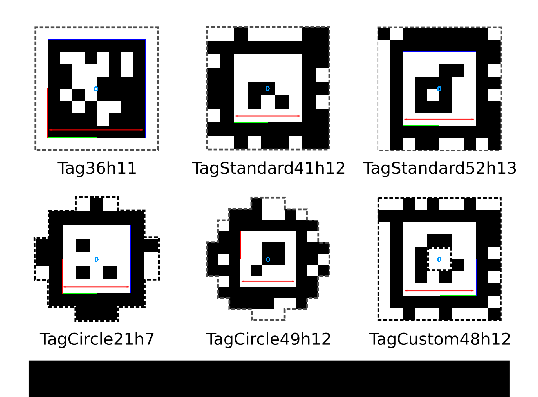

# apriltag_ros

`apriltag_ros` is a Robot Operating System (ROS) wrapper of the [AprilTag 3 visual fiducial detector](https://april.eecs.umich.edu/software/apriltag.html). For details and tutorials, please see the [ROS wiki](http://wiki.ros.org/apriltag_ros).

`apriltag_ros` depends on the latest release of the [AprilTag library](https://github.com/AprilRobotics/apriltag). Clone it into your catkin workspace before building.

**Authors**: Danylo Malyuta, Wolfgang Merkt

**Maintainers**: [Danylo Malyuta](mailto:danylo.malyuta@gmail.com) ([Autonomous Control Laboratory](https://www.aa.washington.edu/research/acl), University of Washington), [Wolfgang Merkt](https://github.com/wxmerkt)

## Quickstart

Starting with a working ROS installation (Kinetic and Melodic are supported):
```
export ROS_DISTRO=melodic               # Set this to your distro, e.g. kinetic or melodic
source /opt/ros/$ROS_DISTRO/setup.bash  # Source your ROS distro 
mkdir -p ~/catkin_ws/src                # Make a new workspace 
cd ~/catkin_ws/src                      # Navigate to the source space
git clone https://github.com/AprilRobotics/apriltag.git      # Clone Apriltag library
git clone https://github.com/AprilRobotics/apriltag_ros.git  # Clone Apriltag ROS wrapper
cd ~/catkin_ws                          # Navigate to the workspace
rosdep install --from-paths src --ignore-src -r -y  # Install any missing packages
catkin build    # Build all packages in the workspace (catkin_make_isolated will work also)
```
See the [ROS wiki](http://wiki.ros.org/apriltag_ros) for details and tutorials.

## Tag Size Definition

For a correct depth estimation (and hence the correct full pose) it is necessary to specify the tag size in config/tags.yaml correctly. In the [Wiki for the AprilTag Library](https://github.com/AprilRobotics/apriltag/wiki/AprilTag-User-Guide#pose-estimation)  the correct interpretation of the term "tag size" is explained. The size is defined by the length of the black/white border between the complete black and white rectangle of any tag type. Note that for apriltag3 marker families this does not in fact correspond to the outside of the marker.

Below is a visualization of the tag size (red arrow) to be specified for the most common tag classes:


## Contributing

Pull requests are welcome! Especially for the following areas:

- Publishing of the AprilTag 3 algorithm intermediate images over a ROS image topic (which AprilTag 3 already generates when `tag_debug==1`)
- Conversion of the bundle calibration script from MATLAB to Python
- Extend calibration to support calibrating tags that cannot appear simultaneously with the master tag, but do appear simultaneously with other tags which themselves or via a similar relationship appear with the master tag (e.g. a bundle with the geometry of a cube - if the master is on one face, tags on the opposite face cannot currently be calibrated). This is basically "transform chaining" and potentially allows calibration of bundles with arbitrary geometry as long as a transform chain exists from any tag to the master tag
- Supporting multiple tag family detection (currently all tags have to be of the same family). This means calling the detector once for each family. Because the core AprilTag 2 algorithm is the performance bottleneck, detection of `n` tag families will possibly decrease performance by `1/n` (tbd if this still holds for v3)

## Changelog

- In March 2019, the code was upgraded to AprilTag 3 and as thus the options `refine_pose`, `refine_decode`, and `black_border` were removed.

## Copyright

The source code in `apriltag_ros/` is original code that is the ROS wrapper itself, see the [LICENSE](https://github.com/AprilRobotics/apriltag_ros/blob/526b9455121ae0bb6b4c1c3db813f0fbdf78393c/LICENSE). It is inspired by [apriltags_ros](https://github.com/RIVeR-Lab/apriltags_ros) and provides a superset of its functionalities.

If you use this code, please kindly inform [Danylo Malyuta](mailto:danylo.malyuta@gmail.com) (to maintain a list here of research works that have benefited from the code) and cite:

- D. Malyuta, C. Brommer, D. Hentzen, T. Stastny, R. Siegwart, and R. Brockers, “[Long-duration fully autonomous operation of rotorcraft unmanned aerial systems for remote-sensing data acquisition](https://onlinelibrary.wiley.com/doi/abs/10.1002/rob.21898),” Journal of Field Robotics, p. arXiv:1908.06381, Aug. 2019.
- C. Brommer, D. Malyuta, D. Hentzen, and R. Brockers, “[Long-duration autonomy for small rotorcraft UAS including recharging](https://ieeexplore.ieee.org/document/8594111),” in IEEE/RSJ International Conference on Intelligent Robots and Systems, IEEE, p. arXiv:1810.05683, oct 2018.
- J. Wang and E. Olson, "[AprilTag 2: Efficient and robust fiducial detection](http://ieeexplore.ieee.org/document/7759617/)," in ''Proceedings of the IEEE/RSJ International Conference on Intelligent Robots and Systems (IROS)'', October 2016.

```
@article{Malyuta2019,
  doi = {10.1002/rob.21898},
  url = {https://doi.org/10.1002/rob.21898},
  pages = {arXiv:1908.06381},
  year = {2019},
  month = aug,
  publisher = {Wiley},
  author = {Danylo Malyuta and Christian Brommer and Daniel Hentzen and Thomas Stastny and Roland Siegwart and Roland Brockers},
  title = {Long-duration fully autonomous operation of rotorcraft unmanned aerial systems for remote-sensing data acquisition},
  journal = {Journal of Field Robotics}
}
@inproceedings{Brommer2018,
  doi = {10.1109/iros.2018.8594111},
  url = {https://doi.org/10.1109/iros.2018.8594111},
  pages = {arXiv:1810.05683},
  year  = {2018},
  month = {oct},
  publisher = {{IEEE}},
  author = {Christian Brommer and Danylo Malyuta and Daniel Hentzen and Roland Brockers},
  title = {Long-Duration Autonomy for Small Rotorcraft {UAS} Including Recharging},
  booktitle = {{IEEE}/{RSJ} International Conference on Intelligent Robots and Systems}
}
@inproceedings{Wang2016,
  author = {Wang, John and Olson, Edwin},
  booktitle = {2016 IEEE/RSJ International Conference on Intelligent Robots and Systems (IROS)},
  doi = {10.1109/IROS.2016.7759617},
  isbn = {978-1-5090-3762-9},
  month = {oct},
  pages = {4193--4198},
  publisher = {IEEE},
  title = {{AprilTag 2: Efficient and robust fiducial detection}},
  year = {2016}
}
```
